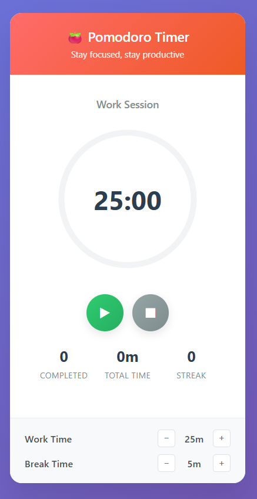

# Pomodorooo - Browser Extension

A beautiful, persistent Pomodoro timer extension for Chrome with daily stats, streak tracking, and automatic light/dark theme based on your system.

---

## Features

- **Pomodoro Timer**: Classic work/break cycles with adjustable durations.
- **Persistent Timer**: Timer and stats continue even if the popup is closed or browser is restarted.
- **Daily Stats**: See how many Pomodoros you’ve completed and total time spent today.
- **Streak Tracking**: Track your consecutive days of productivity.
- **Modern UI**: Clean, responsive design with automatic light/dark mode matching your system.
- **Notifications**: Get notified when a session ends.
- **No Account Needed**: All data is stored locally in your browser.

---

## Installation

1. **Clone or Download** this repository.
2. Open Chrome and go to `chrome://extensions/`.
3. Enable **Developer mode** (top right).
4. Click **Load unpacked** and select the project folder.
5. The Pomodorooo icon will appear in your browser toolbar.

---

## Usage

1. Click the Pomodorooo icon to open the popup.
2. Press ▶ to start your work session.
3. Use ⏸ to pause, ⏹ to reset.
4. Adjust work/break durations in the settings section.
5. View your daily completed sessions, total time, and streak at a glance.
6. The theme will automatically match your system (light or dark).

---

## Customization

- **Work/Break Duration**: Use the +/− buttons in the settings to change durations.
- **Theme**: The extension automatically follows your system/browser theme.

---

## Tech Stack

- **Manifest V3** Chrome Extension
- **JavaScript** (background, popup)
- **HTML/CSS** (responsive, dark/light theme)
- **chrome.storage** for persistence
- **chrome.alarms** for background timer
- **chrome.notifications** for alerts

---

## Screenshots

---

## License

MIT License

---

## Credits

Made with ❤️ for productivity!